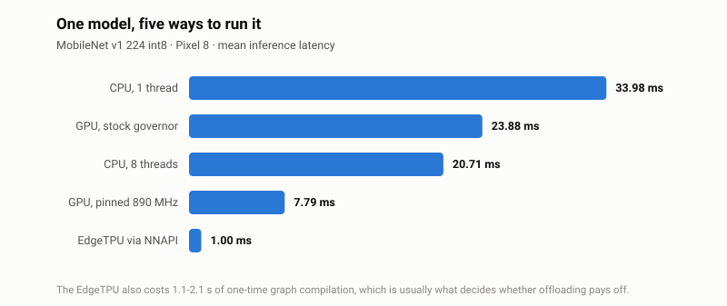
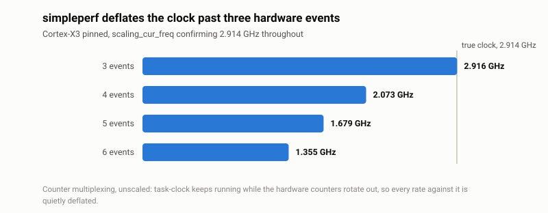
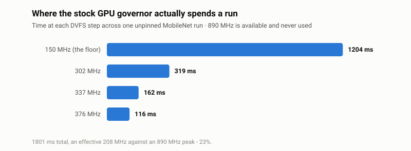
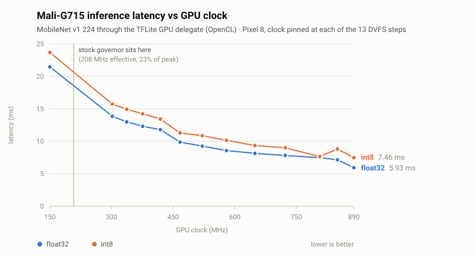

# pixel-bench

CPU, GPU and NPU benchmarks for the Pixel 8 (shiba, Tensor G3), built to run on a plain
`AOSP_on_shiba` userdebug build — no Play Store, no GMS, no vendor benchmark apps.

The point of these scripts is not the numbers. It is that **every measurement carries
its own evidence that it measured what it claims to**. Each of the three units has at
least one failure mode that produces a plausible, wrong, quietly-accepted result, and
each script checks for its own.

<picture>
  <source media="(prefers-color-scheme: dark)" srcset="docs/backends-dark.svg">
  
</picture>

Two of those five rows are traps rather than results. The GPU row that looks
CPU-class is the stock governor never leaving idle clocks, and a naive EdgeTPU run
can silently be a CPU run. Both are covered below.

```
CPU  (per cluster, governor pinned)
  CLUSTER       GHz     IPC   BR-MISS%
  little      1.728   0.812      5.76%
  mid         2.377   1.170      1.07%
  big         2.838   1.127      0.96%
```

Full output from that run is in [`report/`](report/). There is also a long-form
write-up of how the whole thing was built, in Traditional Chinese:
[`article-zh.md`](article-zh.md).

## Quick start

```sh
./fetch-assets.sh     # ~130 MB of TFLite binary and models, once
./bench-all.sh        # full run, about two minutes
```

Results land in `results/<timestamp>/` as three logs plus a combined `summary.txt`.

## Requirements

- A Pixel 8 (`shiba`) on a **userdebug** build with `adb root` available. The scripts
  refuse to run otherwise — they need to write `scaling_governor` and read PMU counters.
- `adb` and `bash` on the host. No NDK, no AOSP checkout, no device build required.
- Tested against Android 15 `BP1A.250505.005.B1`, kernel `6.1.99-android14-11`.

Other Tensor devices will need the sysfs paths changed: the Mali node
(`1f000000.mali`), the TPU node (`1a000000.rio`) and the cluster layout are all
shiba-specific.

## Scripts

| Script | What it does |
|---|---|
| `bench-all.sh` | Runs the three in sequence, gates each stage on temperature, writes the combined report. **Start here.** |
| `cpu-bench.sh` | Per-cluster PMU benchmark — IPC, effective clock, branch and L1D miss rates |
| `gpu-bench.sh` | Mali-G715 via the TFLite GPU delegate, with DVFS pinning and a frequency sweep |
| `npu-bench.sh` | EdgeTPU via NNAPI, against CPU baselines |
| `fetch-assets.sh` | Downloads the TFLite binary and models into `tflite/` |

Useful options, all four accept `-h`:

```sh
./bench-all.sh -u cpu,npu -q          # subset, quick mode
./bench-all.sh -a big                 # bind the accelerator benchmarks to the X3
./bench-all.sh -g powersave           # low-power CPU figure
./gpu-bench.sh --sweep                # performance against clock, all 13 DVFS steps
./cpu-bench.sh -w /data/local/tmp/my_binary   # measure your own workload
```

## What these scripts are actually guarding against

Everything below was measured on the device, not inferred.

### CPU — three ways `simpleperf` lies quietly

**`task-clock` must be in every event list.** Without it simpleperf divides by
wall-clock time, so anything that sleeps reports a nonsense frequency — a test binary
that mostly waits on ioctls read as 0.75 GHz.

**At most three hardware events per run.** A fourth silently multiplexes the counters,
and simpleperf does not scale the counts back up. `task-clock` is a software event that
keeps running while the hardware counters are rotated out, so every rate computed
against it is deflated. On the X3, with the governor pinned and `scaling_cur_freq`
confirming 2.914 GHz:

<picture>
  <source media="(prefers-color-scheme: dark)" srcset="docs/multiplex-dark.svg">
  
</picture>

Nothing warns you. The script collects counters in several passes of three instead.

**The generic event aliases are not portable across these cores.** `simpleperf list raw`
prints a support mask per event, and it matters: `branch-instructions` resolves to
`raw-br-immed-retired`, *supported on cpu 0-7 only*, which on the X3 returns either 0 or
a garbage 1.7M against a true 14M. `L1-dcache-load-misses` resolves to
`raw-l1d-cache-refill-rd`, cpu 0-3 and 8 only, so the A715 cluster is wrong too. This
repo uses `raw-br-retired`, `raw-br-mis-pred-retired`, `raw-l1d-cache` and
`raw-l1d-cache-refill`, all confirmed on cpu 0-8.

The self-check is in the output: the `BR(M)` column must come out the same on all three
clusters, because it is the same instruction stream. It does — ~14M everywhere.

### GPU — the stock governor never ramps

Left on the default `adaptive` power policy, MobileNet v1 float32 measures 21.8 ms
through the GPU delegate, indistinguishable from the CPU's 20.3 ms. That invites the
conclusion that the Mali is not worth using. Pin the clock and the same graph runs in
**6.99 ms**.

The residency counters say why:

<picture>
  <source media="(prefers-color-scheme: dark)" srcset="docs/gpu-residency-dark.svg">
  
</picture>

An effective 208 MHz against an 890 MHz peak, **23%** — each inference finishes before
the governor reacts.

So every GPU row reports `EFF-MHz`, derived from the `time_in_state` delta over that
run. A pinned row that reports a low effective clock means the pin did not take, not
that the GPU is slow.

(You may see it claimed that Tensor G3 exposes no OpenCL and so cannot do GPU
inference. Not on this device: `libOpenCL.so` is present and listed in
`/vendor/etc/public.libraries.txt`, so it is reachable from apps as well as from a
shell binary, and every GPU number here came through it.)

`--sweep` walks all 13 steps:

<picture>
  <source media="(prefers-color-scheme: dark)" srcset="docs/gpu-sweep-dark.svg">
  
</picture>

Performance scales only **3.0x across a 5.9x clock range**, so this workload is
bandwidth-bound above roughly 580 MHz — most of the benefit is available well below the
top step, which matters if you are pinning for throughput per watt rather than raw
latency. The marker at 208 MHz is where the stock governor actually leaves the GPU.

<details>
<summary>Sweep data</summary>

| clock (MHz) | float32 (ms) | int8 (ms) |
|---:|---:|---:|
| 890 | 5.93 | 7.46 |
| 850 | 7.15 | 8.81 |
| 807 | 7.47 | 7.64 |
| 723 | 7.81 | 9.00 |
| 649 | 8.14 | 9.34 |
| 580 | 8.57 | 10.14 |
| 521 | 9.25 | 10.87 |
| 467 | 9.86 | 11.28 |
| 419 | 11.79 | 13.42 |
| 376 | 12.31 | 14.22 |
| 337 | 12.98 | 14.93 |
| 302 | 13.85 | 15.72 |
| 150 | 21.45 | 23.68 |

From [`report/gpu.log`](report/gpu.log); regenerate with `tools/mk-charts.py`. The
int8 850 MHz point sits above its 807 MHz neighbour — run-to-run noise of a few percent,
left in rather than smoothed away. Every row measured `%PINNED` at 100%, so each timing
belongs to the clock its label claims.

</details>

### NPU — NNAPI falls back to the CPU without saying so

The EdgeTPU works on a plain AOSP build. No GMS needed:

```sh
adb shell service list | grep -i neural
# android.hardware.neuralnetworks.IDevice/google-edgetpu
```

But ask for `google-edgetpu` with a graph it cannot take — a float32 model, say — and
TFLite still prints `NNAPI delegate created` and even reports 31/31 nodes delegated,
then logs `the model graph will not be executed by the delegate` and runs XNNPACK on the
CPU. The row looks entirely legitimate. Only int8 quantized graphs reach the
accelerator.

The only evidence that survives is the hardware counter at
`/sys/devices/platform/1a000000.rio/inference_count`. Its delta must match the iteration
count the benchmark reports — verified at 1463 against 1463. Every NNAPI run is checked
this way, and the `TPU-INF` column shows it: zero on CPU rows, the real inference count
on TPU rows.

Watch the init column too. Compiling MobileNet for the TPU costs 1.1–2.1 s per process,
which dwarfs any single 1 ms inference and is usually what decides whether offloading is
worth it at all.

**On NNAPI being deprecated.** It is, [as of Android 15](https://developer.android.com/ndk/guides/neuralnetworks/migration-guide),
and the successor is LiteRT with a per-vendor NPU delegate. Worth being precise about
what that changes here, because most of this harness is already on the new path:
`benchmark_model` *is* LiteRT's own benchmark tool, and the CPU (XNNPACK) and GPU
(`--use_gpu`) legs above are current LiteRT delegates, not deprecated ones.

Only the NPU leg has no replacement on this chip. LiteRT's
[NPU delegate page](https://developers.google.com/edge/litert/android/npu/overview)
ships delegates for Qualcomm and Intel and lists Google Pixel as coming; the
[Google Tensor SDK](https://developers.google.com/edge/litert/next/tensor-sdk), which
reaches the TPU through the newer CompiledModel API, is in beta behind a sign-up and
states it "supports the following SoCs: Google Tensor G5" — Pixel 10, not this
Tensor G3. So for TFLite on this device, deprecated NNAPI is still the only route to
the TPU, and it still works: everything above was measured through it.

That is not just read off the docs. No library on the device exports
`tflite_plugin_create_delegate`, so `--external_delegate_path` has nothing to bind to:
handing it `libedgetpu_client.google.so` gets as far as "EXTERNAL delegate created",
then segfaults, with the `inference_count` delta at zero. When a G3-capable delegate
does appear, that flag is where it plugs in, and this harness needs no change.

> **Correction (2026-08-21).** This section previously claimed the vendor TPU
> libraries export "115 C++ symbols and **no** C ABI", and concluded there was no
> non-NNAPI path at all. That was wrong: it generalised from a single library.
> `libedgetpu_client.google.so` is indeed mostly C++ (48 exports, 41 mangled), but
> `libedgetpu_util.so` — listed in the same `/vendor/etc/public.libraries.txt`, so
> equally reachable from an app — exports **256 symbols, every one of them C**: 199
> `DarwinnApi2_*` and 12 `DarwinnDelegate_*`, including
> `DarwinnDelegate_CreateVirtualDevice`, `DarwinnApi2_VirtualDevice_RegisterGraph`,
> `RequestQueue_Submit`, `Request_Wait` and `Request_TimingInfo_GetTpuWorkNsec`. A
> non-TFLite route to the TPU does exist.
>
> What blocks it is the compiler, not the ABI. `RegisterGraph` takes an
> already-compiled Darwinn graph container, never a `.tflite`, and the runtime says so
> itself: *"Please recompile the model with the latest compiler"*, *"Graph container
> version ... make sure the graph is compiled with the right version"*, *"You might
> have compiled your model for <= P24 but it is running on a P25+ device"*. Producing
> that container needs the Tensor SDK compiler. Re-checked on a Tensor G5 (Pixel 10,
> Android 16): the same `DarwinnApi2_*` family, 236 exports all C, plus a
> `libedgetpu_litert.so` carrying a further 63-function Tachyon C API — and still no
> `tflite_plugin_create_delegate` on either chip.
>
> Every measurement in this README went through NNAPI and is unaffected.

### The cluster feeding an accelerator shows up in its result

Same TPU, same model, only the host thread's affinity changed:

| affinity | EdgeTPU inference |
|---|---|
| little (A510) | 1.53 ms |
| big (X3) | 0.93 ms |

62%, with identical work on the accelerator — the delegate dispatch is CPU-side. All
three scripts take `-a little\|mid\|big\|all`; leaving it unbound puts the result at the
scheduler's mercy.

## Why `bench-all.sh` rather than three commands

- **The stages must not overlap.** `cpu-bench.sh` pins every cpufreq policy and
  `gpu-bench.sh` pins the Mali clock; either distorts the other.
- **Heat accumulates.** Idle is 32–34 °C and a stage peaks near 43 °C, so a benchmark
  started straight after another reads slow. Each stage waits for every relevant thermal
  zone to fall below `--cool` (default 38 °C).
- **Preflight happens once**, up front, rather than failing five minutes in.
- **The device gets checked afterwards.** Each script restores its own state on
  EXIT/INT/TERM, but if one is killed hard the phone is left pinned. The runner verifies
  and says so loudly.

## Reference numbers

Pixel 8, Android 15 `BP1A.250505.005.B1`, kernel `6.1.99-android14-11`.

CPU, sha256sum over 64 MB, governor pinned:

| cluster | core | clock | IPC | branch miss |
|---|---|---|---|---|
| little | Cortex-A510 ×4 | 1.73 GHz | 0.81 | 5.8% |
| mid | Cortex-A715 ×4 | 2.38 GHz | 1.17 | 1.1% |
| big | Cortex-X3 ×1 | 2.84 GHz | 1.13 | 1.0% |

Under `-g powersave` each cluster parks at its floor — 324 / 402 / 500 MHz, about 17–19%
of peak.

MobileNet v1 224 int8:

| backend | latency | vs 1 thread |
|---|---|---|
| CPU, 1 thread (XNNPACK) | 33.98 ms | 1.0x |
| CPU, 8 threads | 20.71 ms | 1.6x |
| GPU, stock governor | 23.44 ms | 1.4x |
| GPU, pinned 890 MHz | 7.46 ms | 4.6x |
| NNAPI `nnapi-reference` | 153.9 ms | 0.2x |
| NNAPI `google-edgetpu` | 1.00 ms | 33.9x |

More threads is not reliably better: on EfficientNet-Lite0, which takes only 5.7 ms on
one thread, eight threads is 4x *slower* — synchronisation overhead plus the A510s
dragging.

## Layout

```
bench-all.sh      cpu-bench.sh    gpu-bench.sh    npu-bench.sh
fetch-assets.sh
tools/            mk-charts.py, which redraws every README chart from report/
docs/             the generated charts, light and dark
docs/png/         the same charts rasterised at 2x, for platforms that reject SVG
report/           reference run committed for the numbers quoted above
results/          local run output (gitignored)
tflite/           downloaded binary and models (gitignored)
```

Each script's header comment documents the traps it handles and the measurements behind
them; they are the long-form version of this README.
